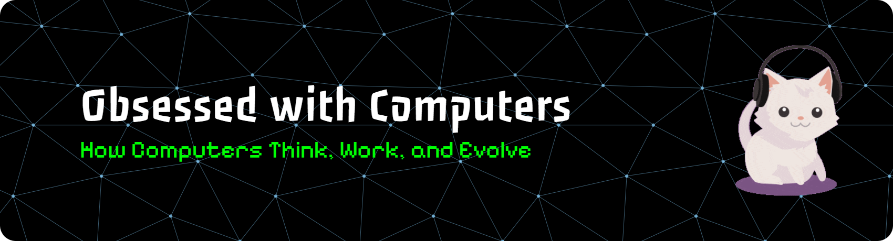

  

# 💫 About Me:
💻 Computer Enthusiast | 🧠 Learning, Building & Exploring Technology | ⚙️ Code • AI • Hardware

## 🌐 Socials:
    

# 💻 Tech Stack:
                                                       !

<h2 data-importer="text" align="left">Creative Technology</h2>

###

  
  
  
  
  
  
  
  
  
  
  
  
  
  
  
  
  
  
  
  
  
  
  
  
  
  
  
  
  
  
  
  
  
  
  
  
  
  
  
  
  
  
  
  
  
  
  
  
  
  
  
  
  

# 📊 GitHub Stats:

  
  

###

<picture data-importer="pacman">
  <source media="(prefers-color-scheme: dark)" srcset="https://raw.githubusercontent.com/archyourname/archyourname/pacman-output/bomberman-contribution-graph-dark.svg?game=bomberman">
  <source media="(prefers-color-scheme: light)" srcset="https://raw.githubusercontent.com/archyourname/archyourname/pacman-output/bomberman-contribution-graph.svg?game=bomberman">
  
</picture>

###
---

<!-- Proudly created with GPRM ( https://gprm.itsvg.in ) -->